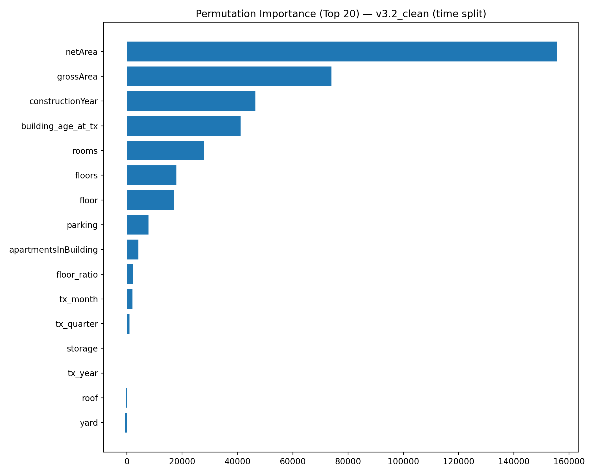
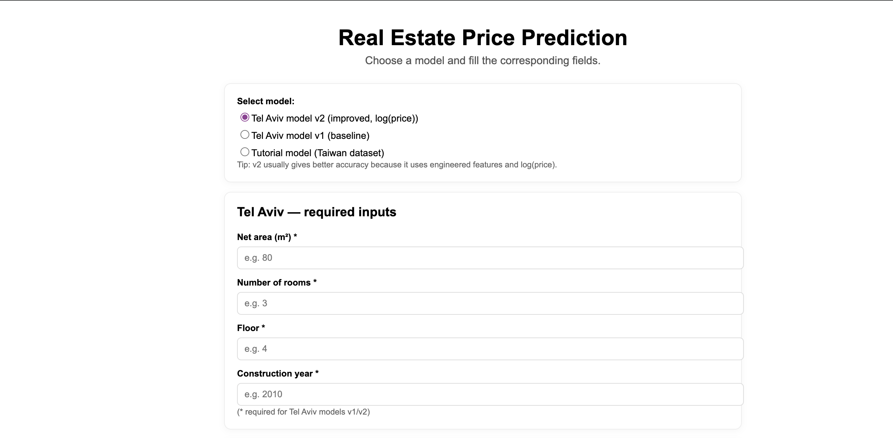
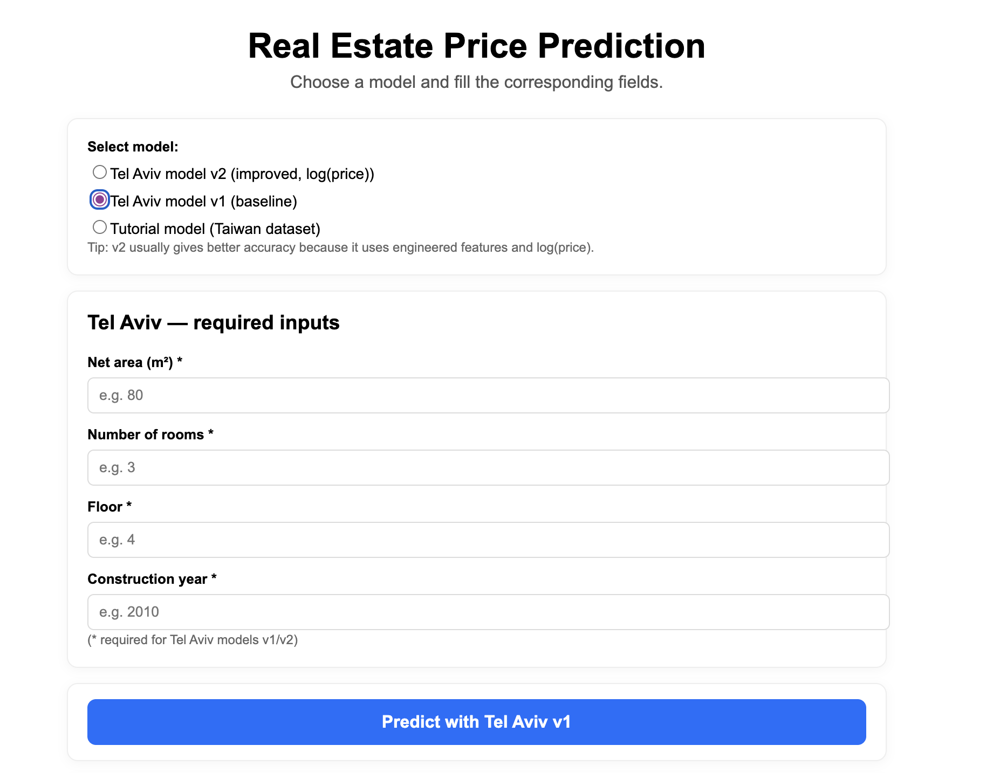
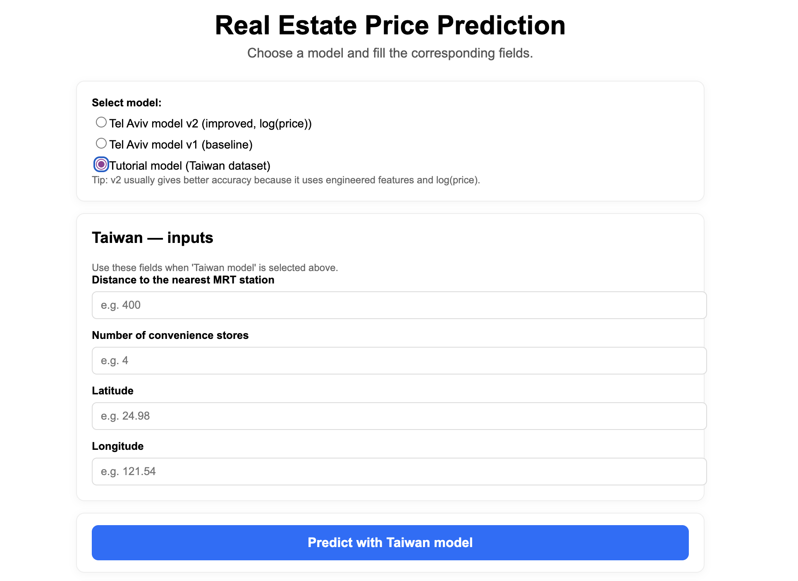
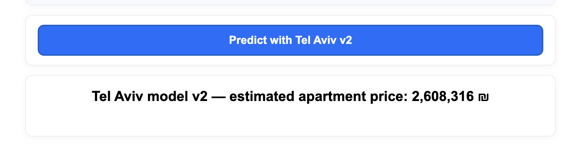

# Real Estate Price Prediction — Tel Aviv (v1 / v2 / v3.2_clean) + Taiwan baseline
[](https://github.com/NikitaMarshchonok/end-to-end-ML-project/actions/workflows/ci.yml)

End-to-end ML portfolio project with a clean **Dash UI** for **real estate price prediction**.  
Covers the full workflow: data checks → feature engineering → model training/versioning → evaluation → interactive inference UI.

**Focus:** Tel Aviv market (multiple versions, best is **v3.2_clean**) + Taiwan tutorial baseline for comparison.

---

## What this project does

- Predicts apartment prices from property characteristics (**Tel Aviv dataset**)
- Uses feature engineering + `log1p(price)` training for stability (v2+)
- Evaluates with a **time-aware split** to reduce leakage (production-style)
- Provides a simple **Dash web app** with model selector + presets
- Saves artifacts: model `.pkl`, feature columns `.json`, metrics `.json`
- Includes **pytest checks** (artifacts + basic sanity)

---

## Problem

Real estate pricing depends on many interacting factors: area, floor, building age, building scale, amenities, and market/time effects.  
Goal: build a practical ML solution that:
- predicts apartment price based on property characteristics,
- improves accuracy via feature engineering + cleaning,
- provides a clean UI for inference,
- keeps model versions comparable.

---

## Data & Features (Tel Aviv)

### Core features (examples)
- `netArea`, `grossArea`, `rooms`, `floor`, `floors`
- `apartmentsInBuilding`, `parking`, `storage`, `roof`, `yard`
- `constructionYear`

### Engineered features (v2+)
- `tx_year`, `tx_month`, `tx_quarter`
- `building_age_at_tx`
- `floor_ratio`

### Target transform (v2+)
Models are trained on:
- `log1p(price)`

Prediction is converted back via:
- `expm1(pred_log)`

---

## Results

### Tel Aviv — Time-aware evaluation (recommended)
Evaluation uses a **time-aware split** to avoid leakage:
- **Train:** before `2018-03-25`
- **Test:** on/after `2018-03-25`

| Version | Model | Split | MAE (NIS) | RMSE (NIS) | R² |
|---|---|---:|---:|---:|---:|
| v2 (fair baseline) | RF(500) + median imputer | Time-aware | 1,076,070 | 1,618,660 | 0.5113 |
| v3 | Tuned RF + missing indicators | Time-aware | 1,025,612 | 1,576,916 | 0.5362 |
| **v3.2_clean (BEST)** | Tuned RF + missing indicators + **data cleaning** | Time-aware | **928,568** | **1,503,636** | **0.5754** |

### Data cleaning impact
- v3 MAE (before cleaning): **1,025,612 NIS**
- v3.2_clean MAE (after cleaning): **928,568 NIS**
- Improvement: **97,044 NIS**

### Error analysis (high-level)
- Errors grow with **price and area** (luxury / rare properties are harder).
- Highest MAE is in the top price quartile and largest area quartile.
- Detected & handled data issues: `constructionYear > transaction year`, invalid/zero areas, extreme prices.

### Feature importance (permutation, time split)
Top drivers: **netArea, grossArea, constructionYear, building_age_at_tx, rooms, floors/floor, parking**.



---


##  Demo (Dash UI)

Run the app:

```bash
python src/app.py
```
Open:
```
http://127.0.0.1:8050
```

##  Run with Docker
```
docker compose up --build
```
Open:
     http://localhost:8050 (Dash demo)
     http://localhost:8000 (FastAPI)
     http://localhost:5173 (Web frontend)


Tests:
    pytest -q

## Architecture (monorepo)

- Dash (`src/app.py`) stays as internal admin/demo UI.
- FastAPI (`src/api/main.py`) exposes `/markets`, `/models`, `/predict`, `/explain`, `/comparables`, `/monitoring`, `/feedback`, `/metrics`, `/metrics/timeseries`, `/health`.
- Frontend in `web/` (Vite + React) renders the product UI and calls the API.
- Predictions history is stored in a DB when `DATABASE_URL` is configured (defaults to SQLite).
- Feedback loop uses the same DB; if you use SQLite and already have `data/predictions.db`, delete it once to apply the new schema.
- Multi-market support requires `market_id` in API requests; `/markets` returns available markets.
- Data contract: `area_unit` can be `m2` (default) or `sqft` and will be normalized on the API side.
- Live FX: API supports `display_currency` (USD/EUR/ILS/TWD) and converts prices via exchangerate.host.


##  Project Structure

```
end-to-end-ml-project/
├── data/
│   ├── Real_estate_Tel_Aviv_20_years.csv
│   └── Real_Estate.csv
├── models/
│   ├── Real_estate_model.pkl
│   ├── tel_aviv_real_estate_model.pkl
│   ├── tel_aviv_real_estate_model_v2.pkl
│   ├── tel_aviv_feature_cols_v2.json
│   ├── tel_aviv_real_estate_model_v3_2_clean_cli.pkl
│   ├── tel_aviv_metrics_v3_2_clean_cli.json
│   └── tel_aviv_feature_cols_v3_2_clean_cli.json
├── notebooks/
│   ├── real_estate_eda.ipynb
│   ├── israel_real_estate_eda.ipynb
│   ├── tel_aviv_model_improvement.ipynb
│   └── israel_tel_aviv_model_improvement.ipynb
├── pics/
│   ├── 1.png
│   ├── 2.png
│   ├── 3.png
│   ├── 4.png
│   ├── 5.png
│   └── tel_aviv_v3_2_perm_importance.png
├── src/
│   ├── app.py
│   └── train_model.py
├── tests/
│   └── test_metrics_json.py
├── Dockerfile
├── docker-compose.yml
├── requirements.txt
└── README.md
```


##  Screenshots

**UI overview + model selector**

*Figure 1: Model selection page with Tel Aviv v2/v1 and Taiwan options.*

---

**Tel Aviv v1 — baseline flow**

*Figure 2: Tel Aviv v1 baseline model with minimal required inputs.*

---

**Taiwan — tutorial model**

*Figure 3: Taiwan tutorial model input form (baseline dataset).*

---

**Tel Aviv v2 — prediction result**

*Figure 4: Tel Aviv v2 predicted price in ₪ after reversing log transformation.*

---

**Tel Aviv v2 — optional fields**

*Figure 5: Optional v2 inputs that can improve prediction accuracy.*

## Model Insights — Permutation Importance (v3.2_clean)

Top drivers: **netArea, grossArea, constructionYear, building_age_at_tx, rooms, floors/floor, parking**.


##  Installation
```
git clone <your-repo-url>
cd <your-repo-folder>

python -m venv venv
source venv/bin/activate  # macOS/Linux
# venv\Scripts\activate   # Windows

pip install -r requirements.txt
```


## Roadmap
```
Short-term (portfolio polish):

 Export metrics snapshot to JSON inside models/

 Add feature importance visualization for Tel Aviv v2

 Add a lightweight “Compare v1 vs v2” UX mode

Mid-term (real-world upgrade):

 Try CatBoost / LightGBM / XGBoost

 Cross-validation + error analysis

 Add richer location/geospatial features if available

MLOps-lite:

 Model metadata: training date, dataset hash, metrics

 Simple /predict API wrapper
```


## Tech Stack
```
Python

Pandas / NumPy

Scikit-learn

Joblib

Dash
```


Author


        Nikita Marshchonok


telegram: @nikitamarshchonok

LinkedIn: https://linkedin.com/in/nikita-marshchonok

email: n.marshchonok@gmail.com
